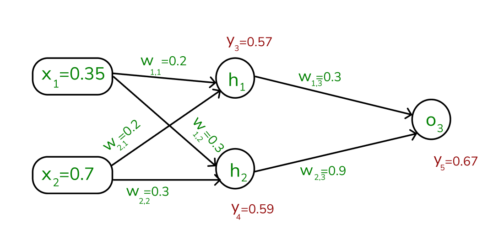

Performing back-propagation on a neural network involves calculating the gradients of the loss function with respect to each weight and bias in the network and then updating these weights and biases using gradient descent. Below, I'll outline the steps and formulas for back-propagation and gradient descent for a simple neural network with:

- 1 input layer with 2 neurons
- 1 hidden layer with 2 neurons
- 1 output layer with 1 neuron
  
  
  
  
  
  
  

